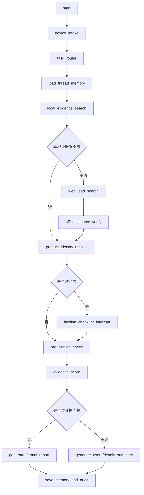

# 保险产品研究 Agent 的 LangGraph 编排设计

## 1. 目标

本项目不做通用聊天机器人，而做：

**可验证保险产品研究 Agent 工作台**

核心链路：

`线索 -> 官方来源 -> 产品身份 -> 资料组件 -> RAG引用 -> 计算/判断 -> 报告 -> 可复核轨迹`

面向用户：

- 保险经纪人
- 产品研究人员
- 保险小白用户
- 内部运营人员

第一版重点：

- 小白能看懂
- 证据能闭环
- 失败能解释
- 过程能追溯
- 记忆能复用
- 上下文能压缩

## 2. LangGraph 设计原则

参考 LangGraph 官方设计方式：

- 把流程拆成离散节点
- 一个节点只做一件事
- State 只存原始数据
- Prompt 在节点内临时格式化
- Checkpointer 负责短期记忆和恢复
- Store 负责长期记忆
- interrupt 负责人工介入
- RetryPolicy 负责临时失败重试
- 上下文过长时 trim / delete / summarize

参考：

- https://docs.langchain.com/oss/python/langgraph/thinking-in-langgraph
- https://docs.langchain.com/oss/python/langgraph/persistence
- https://docs.langchain.com/oss/python/langgraph/add-memory

## 3. 总体拆分

不要做一张超大图。第一版拆成三张子图：

| 子图 | 名称 | 作用 |
|---|---|---|
| 新手交互图 | `user_intake_graph` | 把小白输入变成结构化任务 |
| 证据研究图 | `evidence_research_graph` | 找官方证据、验证闭环、建立产品身份 |
| 报告生成图 | `report_graph` | 生成小白摘要、内部报告、证据卡 |

跨图能力：

| 能力 | 名称 |
|---|---|
| 记忆 | `memory_layer` |
| 上下文压缩 | `context_compaction_layer` |
| 权限门禁 | `permission_gate_layer` |
| 审计日志 | `audit_log_layer` |

## 4. 主流程



## 5. 子图一：user_intake_graph

### 5.1 作用

把小白用户的自然语言输入，转成结构化研究任务。

### 5.2 节点

| Node | 类型 | 作用 |
|---|---|---|
| `novice_intake` | LLM | 提取公司、产品、问题、用户意图 |
| `clarify_with_choices` | User input | 给 2-3 个选项让用户确认 |
| `task_router` | LLM / Rule | 路由到找资料、查身份、做对比、查分红、查条款 |
| `load_user_profile` | Data | 读取用户偏好和历史任务 |
| `plain_progress_start` | Action | 生成小白可读的任务说明 |

### 5.3 小白交互规则

| 场景 | 规则 |
|---|---|
| 用户说不清公司 | 给候选公司 |
| 用户说产品简称 | 给候选官方名 |
| 用户问题太宽 | 拆成 2-3 个可选任务 |
| 用户要结论 | 先解释证据等级 |
| 用户要推荐 | 转成资料研究，不输出购买建议 |

## 6. 子图二：evidence_research_graph

### 6.1 作用

寻找、验证、组织官方证据。

### 6.2 节点

| Node | 类型 | 作用 |
|---|---|---|
| `load_thread_memory` | Data | 读取当前任务历史 |
| `local_evidence_search` | Data | 查本地 spec、PDF清单、RAG metadata |
| `evidence_gap_check` | Rule | 判断是否缺资料 |
| `web_lead_search` | ReAct inside node | 搜索网络线索 |
| `official_source_verify` | Data / Action | 回到官网验证来源 |
| `pdf_download_verify` | Action | 下载 PDF 并做魔数校验 |
| `product_identity_resolve` | LLM / Rule | 解析市场名、官方名、组件关系 |
| `iachina_check_or_interrupt` | User input / Action | 财产险中保协核验 |
| `rag_citation_check` | Data | 检查关键结论是否有 chunk 引用 |
| `evidence_score` | Rule | 计算证据分 |
| `evidence_gate` | Rule | 决定正式报告、草稿、停止 |

### 6.3 ReAct 使用边界

ReAct 只放在这些节点内部：

- `web_lead_search`
- `official_source_verify`
- `product_identity_resolve`

主图不用 ReAct 控制全流程。

## 7. 子图三：report_graph

### 7.1 作用

把研究结果输出成小白能看懂、内部能复核的结果。

### 7.2 节点

| Node | 类型 | 作用 |
|---|---|---|
| `generate_user_friendly_summary` | LLM | 小白摘要 |
| `generate_evidence_cards` | LLM / Template | 证据卡 |
| `generate_gap_cards` | Template | 未闭环项 |
| `generate_formal_report` | LLM / Template | 内部研究报告 |
| `generate_next_steps` | LLM / Rule | 下一步建议 |
| `save_memory_and_audit` | Action | 保存记忆和审计日志 |

### 7.3 小白输出格式

固定输出四块：

1. 我查到了什么
2. 哪些是官方证据
3. 还有哪些没确认
4. 下一步你可以点什么

## 8. State 设计

State 只存原始数据，不存大段 prompt。

```python
class AgentState(TypedDict):
    run_id: str
    thread_id: str
    user_id: str

    user_input: str
    task_type: str
    user_level: str

    company_name: str | None
    product_name: str | None
    aliases: list[str]

    local_candidates: list[dict]
    web_leads: list[dict]
    official_sources: list[dict]
    pdf_assets: list[dict]

    product_identity: dict | None
    iachina_status: dict | None

    rag_citations: list[dict]
    evidence_score: dict | None
    stop_reasons: list[dict]

    messages: list
    conversation_summary: str | None
    tool_events: list[dict]
    user_visible_steps: list[dict]

    context_budget: dict
    final_summary: str | None
    final_report: str | None
```

## 9. 记忆机制

### 9.1 五层记忆

| 层级 | 名称 | 保存内容 | 存储 |
|---|---|---|---|
| 短期记忆 | `thread_memory` | 当前任务 State、对话、节点结果 | LangGraph checkpointer |
| 用户记忆 | `user_memory` | 用户偏好、小白程度、常用格式 | LangGraph Store / DB |
| 项目知识记忆 | `project_memory` | 保险公司入口、证据源、产品别名 | SQLite / Postgres |
| 证据记忆 | `evidence_memory` | PDF、chunk、hash、来源等级 | RAG库 + SQLite |
| 审计记忆 | `audit_memory` | 工具调用、URL、失败原因、重试次数 | events.jsonl / DB |

### 9.2 thread_id 规则

```text
thread_id = user_id + ":" + task_id
```

同一个用户继续同一个研究任务时，沿用同一个 `thread_id`。

### 9.3 短期记忆

开发环境：

- `InMemorySaver`

生产环境：

- `PostgresSaver`

保存内容：

- 当前节点
- State 快照
- interrupt 暂停点
- 工具结果
- 用户确认结果

### 9.4 长期记忆

建议命名空间：

| namespace | 内容 |
|---|---|
| `("user", user_id, "profile")` | 用户偏好 |
| `("user", user_id, "recent_tasks")` | 最近任务 |
| `("project", "source_registry")` | 证据源注册表 |
| `("project", "product_alias")` | 产品别名 |
| `("project", "company_profile")` | 公司资料 |

长期记忆不能直接当证据。  
长期记忆只能作为线索，正式结论仍然必须走证据门禁。

## 10. 上下文压缩机制

### 10.1 新增节点

| Node | 作用 |
|---|---|
| `context_budget_check` | 检查 messages、tool_events、evidence 数量 |
| `summarize_conversation` | 压缩历史对话 |
| `summarize_tool_events` | 压缩工具轨迹 |
| `summarize_evidence_candidates` | 压缩候选证据 |
| `build_llm_context` | 为当前 LLM 节点临时拼接上下文 |

### 10.2 触发条件

| 条件 | 动作 |
|---|---|
| messages 过长 | 保留最近 N 轮 + conversation_summary |
| tool_events 过多 | 压缩成成功、失败、下一步 |
| web_leads 过多 | 只保留 top candidates |
| PDF 内容过长 | 只保留 chunk_id、页码、短摘录 |
| 多轮继续任务 | 加载 thread summary，不加载全历史 |

### 10.3 压缩后保留

永远保留：

- 用户原始输入
- 公司名
- 产品名
- 官方来源 URL
- PDF hash
- chunk_id
- 页码
- 证据等级
- 失败原因
- 用户确认记录

可以压缩：

- 搜索结果摘要
- 网页正文
- 工具 stdout
- 多轮闲聊
- 重复候选资料

### 10.4 上下文原则

LLM 只拿当前节点需要的上下文。

例如：

- `novice_intake` 只拿用户输入、用户偏好、最近任务
- `official_source_verify` 只拿候选 URL、公司名、产品名
- `rag_citation_check` 只拿官方材料 metadata、候选 chunk
- `generate_report` 只拿已过门禁的证据和未闭环项

## 11. 工具层

| Tool | 作用 |
|---|---|
| `search_local_specs` | 查本地公司 spec |
| `search_pdf_links` | 查 PDF 清单 |
| `rag_search` | RAG 检索 |
| `http_get` | 官网 GET |
| `web_extract` | 网页提取 |
| `firecrawl_scrape` | SPA 抓取 |
| `playwright_capture` | 浏览器抓取 |
| `download_pdf` | PDF 下载 |
| `validate_pdf` | PDF 魔数验证 |
| `parse_pdf` | PDF 解析 |
| `check_chunk_citations` | 引用检查 |
| `query_iachina_property_product` | 中保协财产险核验 |
| `resolve_product_alias` | 产品别名解析 |
| `compute_file_hash` | 文件 hash |
| `render_report` | 报告渲染 |

## 12. 权限门禁

| Gate | 规则 |
|---|---|
| `evidence_gate` | 证据不足不生成正式结论 |
| `official_closure_gate` | 官网未闭环不入正式报告 |
| `verify_before_rag_gate` | PDF 未验证不入 RAG |
| `empty_result_deny_gate` | 空结果不编产品清单 |
| `secret_write_deny_gate` | 禁止写密钥 |
| `cookie_write_deny_gate` | 禁止写 Cookie |
| `waf_session_gate` | WAF 需要人工授权会话 |
| `delete_gate` | 删除文件需确认 |
| `shell_command_gate` | Shell 命令需白名单或确认 |
| `human_review_gate` | 关键不确定项暂停 |

## 13. interrupt 场景

| 场景 | interrupt 内容 |
|---|---|
| 公司不确定 | 给候选公司 |
| 产品不确定 | 给候选产品 |
| 需要中保协登录 | 请求人工登录 |
| 遇到验证码 | 请求人工验证 |
| WAF 需要浏览器会话 | 请求授权浏览器会话 |
| 证据不足但用户想继续 | 请求确认生成草稿 |
| 删除/覆盖文件 | 请求确认 |
| 输出正式报告前 | 请求人工复核 |

## 14. 失败处理

| 失败类型 | 处理 |
|---|---|
| 网络超时 | RetryPolicy |
| 429 / 限流 | RetryPolicy + 降速 |
| 官网打不开 | 记录失败原因 |
| PDF 下载失败 | 停止声称全量落盘 |
| PDF 魔数失败 | 停止入库 |
| PDF 解析 0 页 | 停止 ingestion |
| PDF 解析 0 字 | 停止 ingestion |
| RAG 无引用 | 输出不足以判断 |
| 中保协未命中 | 标记协会查询未命中 |
| 中保协需登录 | interrupt |
| 产品身份冲突 | human_review_gate |
| LLM 空响应 | 停止生成 |

## 15. 审计日志

每次运行生成：

```text
runs/{run_id}/events.jsonl
```

每条事件字段：

```json
{
  "run_id": "...",
  "thread_id": "...",
  "timestamp": "...",
  "node": "...",
  "tool": "...",
  "input_summary": "...",
  "output_summary": "...",
  "url": "...",
  "file_path": "...",
  "status": "success|fail|skip|interrupt",
  "error": null,
  "duration_ms": 0
}
```

小白工作台展示：

- 当前查到哪一步
- 找到了几个官方来源
- 哪些失败
- 为什么失败
- 下一步需要用户做什么

## 16. 第一阶段实施范围

第一阶段只做最小闭环：

```text
novice_intake
-> task_router
-> local_evidence_search
-> web_lead_search
-> official_source_verify
-> product_identity_resolve
-> rag_citation_check
-> evidence_score
-> generate_user_friendly_summary
-> save_memory_and_audit
```

第一阶段暂不做：

- 完整 IRR
- 完整产品对比
- 自动全网爬取
- 完整报告模板
- 自动登录中保协

## 17. 验收标准

| 项目 | 标准 |
|---|---|
| 小白可用 | 用户能看懂查了什么、缺什么、下一步做什么 |
| 证据闭环 | 官方来源、URL、hash、chunk_id 可追溯 |
| 失败透明 | 失败原因进入用户可见轨迹 |
| 记忆可续跑 | 同一 thread_id 可继续任务 |
| 上下文可控 | 长任务不会把所有日志塞进 LLM |
| 安全合规 | 不输出投保建议、收益承诺、密钥/Cookie |

## 18. 下一步

下一步写实现计划：

1. 定义 `AgentState`
2. 建立 checkpointer
3. 建立 store
4. 实现 `user_intake_graph`
5. 实现 `evidence_research_graph`
6. 实现 `context_compaction_layer`
7. 实现 `audit_log_layer`
8. 接入 FastAPI
9. 接入前端轨迹台

